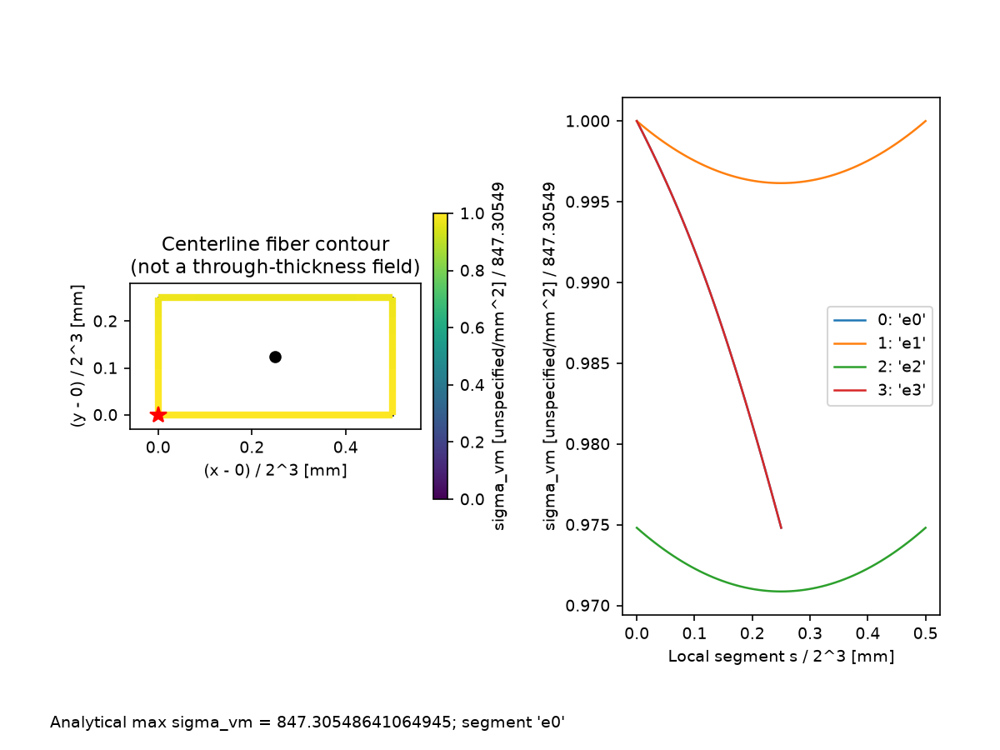

# ThinWallX

[](https://github.com/bboranozdemir-lgtm/ThinWallX/actions/workflows/ci.yml)
[](https://www.python.org/downloads/)
[](https://opensource.org/licenses/MIT)

**ThinWallX** is a Python library and command-line tool for thin-walled structural cross-sections. It evaluates closed-form centerline integrals in float64 for open, closed (multi-cell), and mixed topologies, without numerical quadrature or finite element meshing.



---

## Key Features

- **Exact Analytical Integrals:** Closed-form line integrals for cross-sectional area $A$, centroid $C=(x_c, y_c)$, second moments of area ($I_x, I_y, I_{xy}$), principal properties ($I_1, I_2, \theta_p$), and Saint-Venant torsion constant $J$.
- **Shear Flow & Shear Center:** Tree-equilibrium transverse shear flow for open sections, Bredt-Batho compatibility circulations for multi-cell closed sections, and shear center $S=(x_s, y_s)$ determination.
- **Vlasov Warping Theory:** Continuous sectorial coordinate field $\omega^\ast(s)$ with zero-mean normalization and sectorial warping constant $C_w$.
- **Stress Recovery & Peak Search:** Analytical stress profiles ($\sigma_{zz}, \tau_{\rm surface}, \sigma_{\rm vm}$) with polynomial root-finding for peak von Mises stress and elastic first-yield multiplier ($\lambda$), rather than sampled peak estimation.
- **Zero Heavy Dependencies:** Core computation runs strictly on Python standard library and `numpy`. Plotting optionally utilizes `matplotlib`.
- **Engineering CLI & Calculation Sheets:** Built-in command line interface (`thinwallx`) with standard UNIX exit codes, streaming piping (`stdin`/`stdout`), and automated GitHub-Flavored Markdown Calculation Sheet generator.
- **CAD & Lossless Interchange:** Exact IEEE-754 float64 hexadecimal JSON serialization and standalone ASCII DXF importer.

---

## Installation

### From Source / Clone
```bash
git clone https://github.com/bboranozdemir-lgtm/ThinWallX.git
cd ThinWallX
pip install -e .
```

To enable headless visualization and technical plot generation:
```bash
pip install -e ".[plots]"
```

---

## Quickstart

### 1. Command-Line Interface (CLI)

ThinWallX provides a unified CLI for inspecting sections, converting CAD files, and solving stress recovery:

```bash
# Inspect cross-section characteristics (Area, Centroid, Inertia, J, Cw)
thinwallx inspect examples/sample_sections/rectangle.dxf

# Run full stress recovery analysis under external loads
thinwallx analyze examples/sample_sections/rectangle.dxf \
  --N 10000 --Vy 5000 --Mx 250000 --sigma-yield 355 \
  --report calculation_report.md \
  --plots-dir ./output_plots

# Directly render section geometry to PNG/SVG
thinwallx plot examples/sample_sections/rectangle.dxf --output geometry.png
```

The rectangle example is a 4 x 2 mm centerline box with thickness 0.01 mm,
encoded by its `THICK_0.01` DXF layer. The CLI `--thickness` option is only a
fallback for entities without mapped thickness; it does not override that layer.
These small sample dimensions demonstrate the interface, not a practical design.
Plot-producing commands require the optional `plots` installation above.

### 2. Python API

```python
from thinwallx import Node, Segment, Section, AppliedLoads

# Define an open channel section (C-Channel: 50x100x50 mm, t=2 mm)
n0 = Node(x=50.0, y=100.0)
n1 = Node(x=0.0, y=100.0)
n2 = Node(x=0.0, y=0.0)
n3 = Node(x=50.0, y=0.0)

section = Section([
    Segment(p1=n0, p2=n1, t=2.0),
    Segment(p1=n1, p2=n2, t=2.0),
    Segment(p1=n2, p2=n3, t=2.0),
])

# Access geometric & torsional properties
print(f"Area: A = {section.area:.2f} mm^2")
print(f"Centroid: C = ({section.cx:.2f}, {section.cy:.2f}) mm")
print(f"Inertia: Ix = {section.Ix:.2f}, Iy = {section.Iy:.2f} mm^4")
print(f"Saint-Venant Torsion: J = {section.J:.2f} mm^4")
print(f"Warping Constant: Cw = {section.Cw:.2f} mm^6")

# Recover stresses under combined loads (Axial + Shear + Bending)
loads = AppliedLoads(N=10000.0, Vy=5000.0, Mx=250000.0, sigma_yield=355.0)
results = section.calculate_stresses(loads)

print(f"Peak Von Mises: {results.max_sigma_vm:.2f} MPa")
print(f"Elastic Load Factor: lambda = {results.load_factor:.3f}")
```

---

## Topology & Capabilities Matrix

| Cross-Section Category | Class | Shear Flow ($q$) | Torsion ($J$) | Warping ($C_w$) | Stress Recovery |
|---|---|---|---|---|---|
| **Open Branched Sections** (I, C, L, T, Z, Hat) | `Section` | Tree Balance | $\frac{1}{3}\sum L_i t_i^3$ | $\int_A (\omega^\ast)^2 dA$ | $\sigma_{zz}, \tau, \sigma_{\rm vm}$ |
| **Closed Multi-Cell Sections** (Box girders, Tubes) | `ClosedSection` | Bredt-Batho | $2\mathbf{A}_c^T \boldsymbol{\phi}$ | Compatibility $\omega^\ast$ | $\sigma_{zz}, \tau, \sigma_{\rm vm}$ |
| **Mixed Topology** (Cells with open fins/branches) | `MixedSection` | Tarjan Decomposition | $J_{\rm BB} + J_{\rm open}$ | Continuous $\omega^\ast$ | $\sigma_{zz}, \tau, \sigma_{\rm vm}$ |

---

## Engineering Assumptions & Scope

- **Thin-Wall Centerline Model:** Geometry is represented by 1D straight segments along wall centerlines with uniform segment thickness $t$.
- **Omitted Effects:** Corner fillets, root radii, and local corner overlap volumes are neglected. Plate through-thickness transverse shear deformation is omitted.
- **Elastic Scope:** ThinWallX calculates linear-elastic section properties and stress distributions. It does not perform plastic hinge analysis, local/global buckling verification, or structural design code checks (AISC/Eurocode). The elastic load factor is a first-yield indicator, not a regulatory safety certification.

---

## Documentation

- **[Theory & Conventions](docs/THEORY_AND_CONVENTIONS.md):** Complete mathematical derivations, coordinate frames, right-hand rules, and sign conventions.
- **[CLI Reference](docs/CLI_REFERENCE.md):** Comprehensive guide to CLI subcommands, options, piping, and exit codes.
- **[Verification Benchmarks](docs/VERIFICATION_BENCHMARKS.md):** Summary of analytical and independent oracle benchmarks.
- **[Developer Guide](START_HERE.md):** Development setup, repository architecture, and contributor rules.
- **[Release & PyPI Guide](docs/RELEASE_GUIDE.md):** Distribution packaging and release procedures.

---

## License

ThinWallX is released under the [MIT License](LICENSE).
