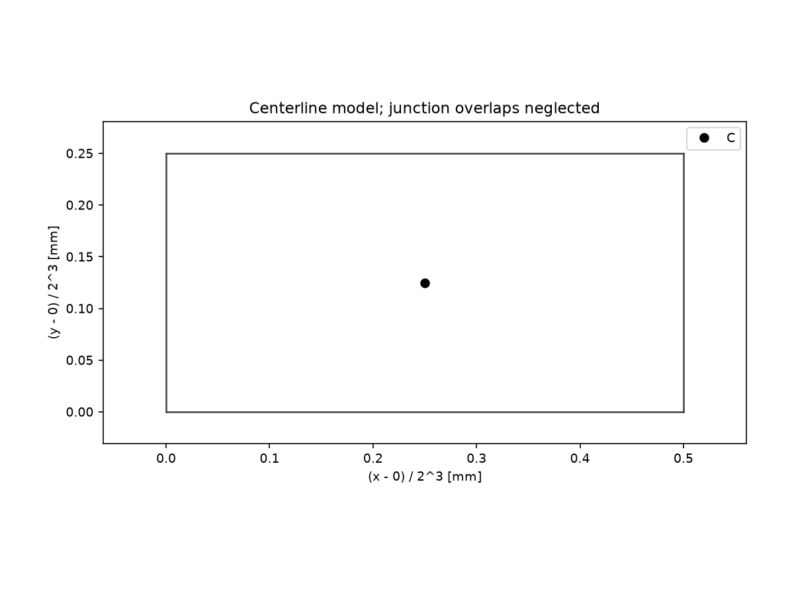
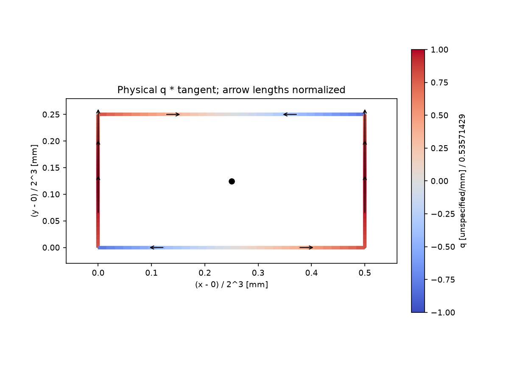

# Sectalix v1.0 Calculation Report

Generated: 2026-09-06T14:35:24.596122+00:00

Input: tests/fixtures/dxf/rectangle&#95;r12.dxf

Units: length=mm, force=unspecified

## Geometry and model assumptions

Topology: closed

| Quantity | Value | Unit |
|---|---:|---|
| segments | 4 | count |
| nodes | 4 | count |
| total&#95;length | 12 | mm |
| t&#95;min | 0.01 | mm |
| t&#95;max | 0.01 | mm |

Linear-elastic thin-wall centerline model. Thickness is constant per segment, not necessarily uniform across the section. Corner overlaps and root radii are neglected. No buckling, plasticity, fatigue, connection or code-compliance verification is performed.

## Section characteristics

| Quantity | Value | Unit |
|---|---:|---|
| A | 0.12 | mm^2 |
| cx | 2 | mm |
| cy | 1 | mm |
| Ix | 0.093333333333333338 | mm^4 |
| Iy | 0.26666666666666666 | mm^4 |
| Ixy | 0 | mm^4 |
| I1 | 0.26666666666666666 | mm^4 |
| I2 | 0.093333333333333324 | mm^4 |
| theta&#95;p | 1.5707963267948966 | rad |
| J | 0.21333333333333335 | mm^4 |
| sx | 1.9999999999999998 | mm |
| sy | 1 | mm |
| Cw | 0.017777777777777792 | mm^6 |
| total&#95;length | 12 | mm |
| t&#95;min | 0.01 | mm |
| t&#95;max | 0.01 | mm |

## Applied loads

| Quantity | Value | Unit |
|---|---:|---|
| N | 100 | unspecified |
| Vx | 0 | unspecified |
| Vy | 2 | unspecified |
| Mx | 1 | unspecified mm |
| My | 0 | unspecified mm |
| Tsv | 0 | unspecified mm |
| B | 0 | unspecified mm^2 |
| M&#95;omega | 0 | unspecified mm |
| sigma&#95;yield | 250 | unspecified/mm^2 |

## Critical stress and elastic yield factor

| Quantity | Value | Unit |
|---|---:|---|
| sigma&#95;vm&#95;max | 847.30548641064945 | unspecified/mm^2 |
| peak&#95;segment&#95;id | &#x27;e0&#x27; | ID |
| s&#95;peak | 0 | mm |
| x&#95;peak | 0 | mm |
| y&#95;peak | 0 | mm |
| load&#95;factor | 0.29505296968989136 | dimensionless |

The load factor is the proportional elastic first-yield multiplier. It is not a design-code safety factor and does not establish regulatory approval.

## Recovered resultants and equilibrium differences

| Resultant | Applied | Recovered | Recovered - applied | Unit |
|---|---:|---:|---:|---|
| N | 100 | 100 | 0 | unspecified |
| Mx | 1 | 0.99999999999998979 | -1.021405182655144e-14 | unspecified mm |
| My | 0 | 0 | 0 | unspecified mm |
| B | 0 | 0 | 0 | unspecified mm^2 |

## Graphical appendices

